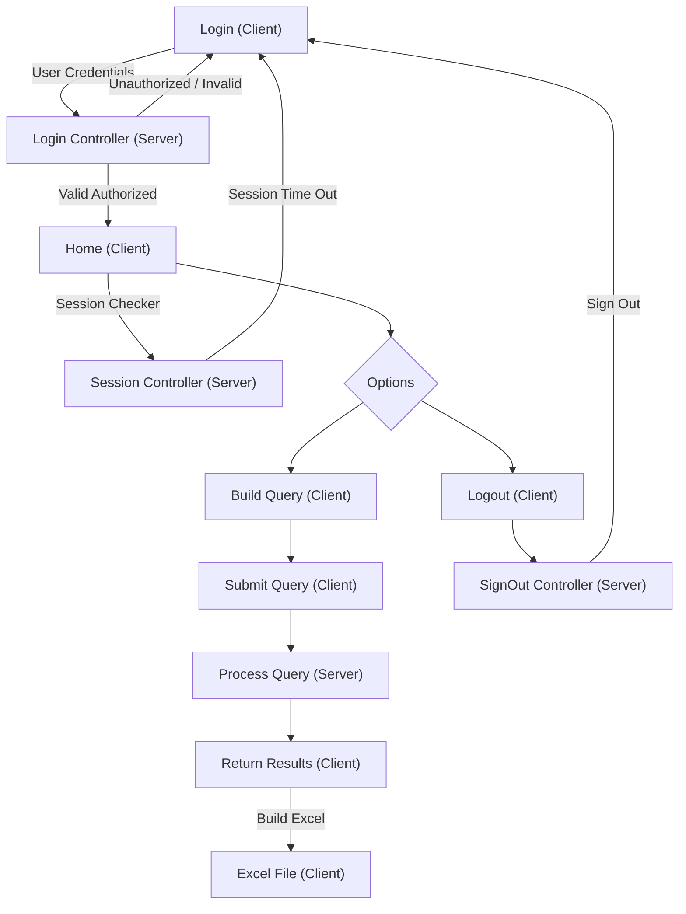

# Custom-Query-App

Custom-Query-App is a custom query application that allows users to build and execute complex queries using an interactive UI. It integrates a React-based frontend with a Node.js and Express backend, and uses Firebase as the database.

---

## Tech Stack

- **Frontend**: React + Vite
- **Backend**: Node.js, Express
- **Libraries**: Material UI (for UI components), Axios (for API requests)
- **Database**: Firebase Realtime Database

---

## Features

### Client-Side (Frontend)

- **Dynamic Homepage**: Responsive homepage for building custom queries with drag-and-drop.
- **Authentication**: Secure login and session management.
- **Custom Query Builder**: Construct queries using logical operators (AND, OR, parentheses) and selectors.
- **Session Validation**: Periodic session checks for secure access.
- **Logout**: Securely logs out users and clears session data.
- **Excel Export**: Download query results as Excel files.

### Server-Side (Backend)

- **Authentication Endpoints**: Handles login, session validation, and logout.
- **Query Processing**: Processes user-submitted queries and fetches results from Firebase.
- **Database Integration**: Fetches and processes data from Firebase Realtime Database.
- **Error Handling**: Comprehensive error handling for invalid requests and server issues.

---

## Project Structure

```
Custom Query App/
├── client/                # Frontend application.
│   ├── public/            # Public assets.
│   ├── src/
│   │   ├── assets/        # Static assets (images, icons).
│   │   ├── components/    # Reusable UI components.
│   │   ├── pages/         # Application pages.
│   │   ├── services/      # API service handlers.
│   │   ├── utils/         # Utility functions and constants.
│   │   ├── App.css
│   │   ├── App.jsx
│   │   ├── index.css
│   │   ├── main.jsx       # Entry point for Vite.
│   ├── .env               # Environment variables for client-side.
│   ├── .gitignore         # Ignored files for Git.
│   ├── index.html
│   ├── package.json
│   ├── package-lock.json
│   ├── eslint.config.js
│   ├── README.md
│   └── vite.config.js
├── server/                # Backend application.
│   ├── controller/        # API controllers.
│   ├── db/                # Database connection.
│   ├── helper/            # Helper functions and validators.
│   ├── middleware/        # Express middleware.
│   ├── router/            # API routes.
│   ├── utils/             # Utility modules and mappings.
│   ├── index.js           # Entry point for server-side.
│   ├── .env               # Environment variables for server-side.
│   ├── .gitignore         # Ignored files for Git.
│   ├── package.json
│   └── package-lock.json
```

---

## Workflow Diagram



---

## Environment Variables

Create a `.env` file within the `client` directory and populate it with your server project credentials:

### client/.env

```
VITE_BASE_SERVER_URL="YOUR_SERVER_URL"
```

Create a `.env` file within the `server` directory and populate it with your Firebase and other project credentials:

### server/.env

```
VITE_APIKEY="YOUR_FIREBASE_API_KEY"
VITE_AUTHDOMAIN="YOUR_FIREBASE_AUTH_DOMAIN"
VITE_DATABASEURL="YOUR_FIREBASE_DATABASE_URL"
VITE_PROJECTID="YOUR_FIREBASE_PROJECT_ID"
VITE_STORAGEBUCKET="YOUR_FIREBASE_STORAGE_BUCKET"
VITE_MESSAGINGSENDERID="YOUR_FIREBASE_MESSAGING_SENDER_ID"
VITE_APPID="YOUR_FIREBASE_APP_ID"
VITE_MEASUREMENTID="YOUR_FIREBASE_MEASUREMENT_ID"
IP_ADDRESS="YOUR_IP_ADDRESS"
PORT="YOUR_PORT"
```

---

## Installation

### client

1. Install dependencies:

   ```bash
   cd client
   npm install
   npm run dev
   ```

### server

1. Install dependencies:

   ```bash
   cd server
   npm install
   node index.js
   ```

---

## API Endpoints

### Authentication

- **POST /auth/login**: Logs in the user.
- **POST /auth/checker**: Validates the session.
- **POST /auth/signout**: Logs out the user.

### Query

- **POST /query/fetch**: Processes and fetches query results.

---

## License

This project is licensed under the MIT License.
